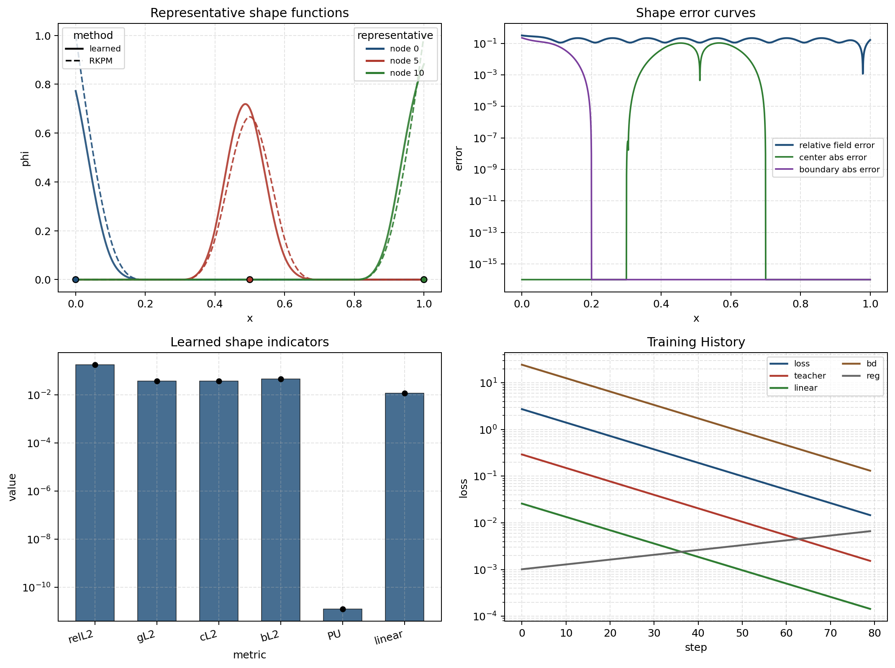
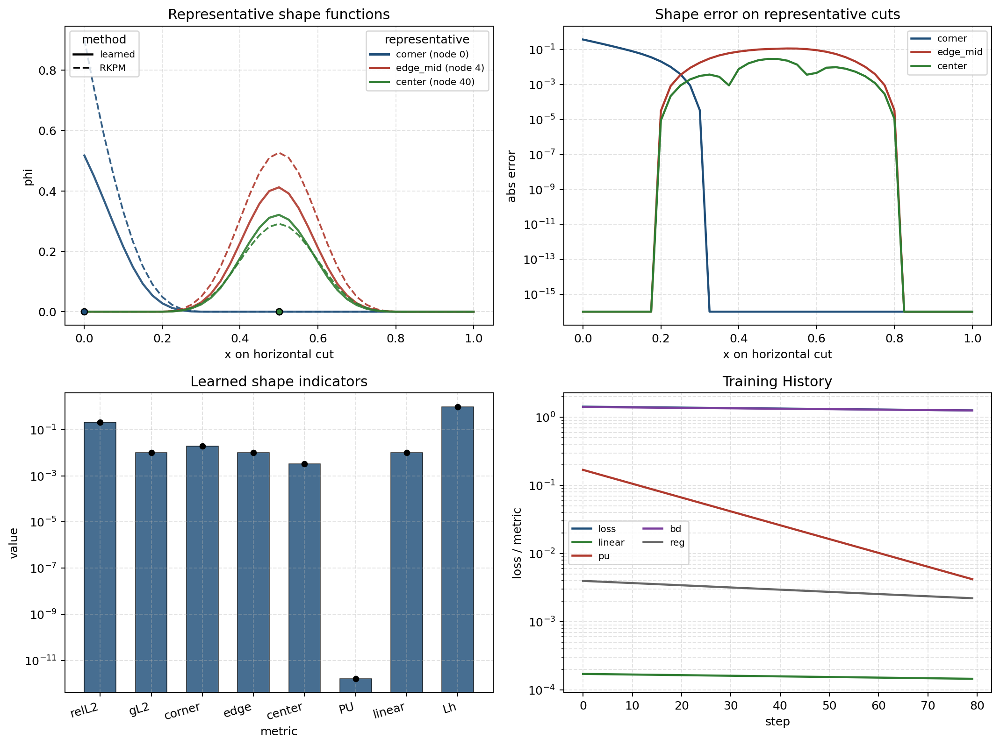
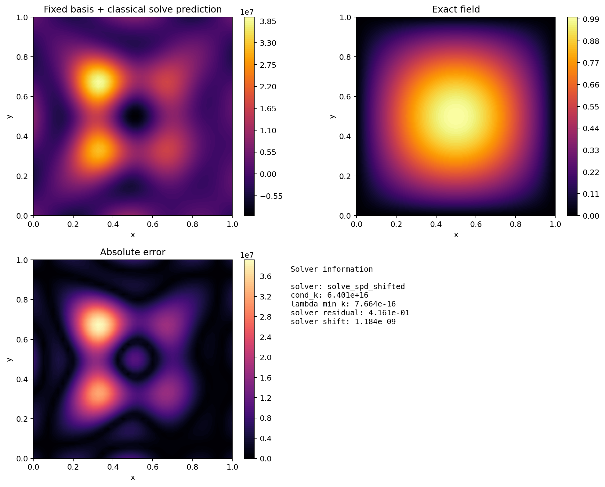

# 最小结果快照

本文档给出一组最小 smoke 结果快照，用来说明仓库当前的标准展示协议：

- `summary.txt` 提供可直接读的结论摘要
- `metrics.json` 提供结构化指标
- `figures/main_figure.png` 提供主图叙事
- `figures/diagnostics/*` 提供补充图

这些快照来自低步数 smoke，只用于说明输出协议和图版式，不代表最终论文数值质量。

## 快照来源

| 主线 | case 路径 | 说明 |
| --- | --- | --- |
| `shape_validation/one_d/uniform_nodes` | `output/shape_validation/one_d/uniform_nodes/nn11_sf2p0_seed42_uniform_teacher_distill_docs_snapshot/` | 1D 规则节点 shape validation smoke |
| `shape_validation/two_d/uniform_nodes` | `output/shape_validation/two_d/uniform_nodes/variant_softplus_raw_pu_bd_ns9_k2p5_seed42_docs_snapshot/` | 2D 规则节点 shape validation smoke |
| `trial_space_value/two_d/poisson_compare/classical` | `output/trial_space_value/two_d/poisson_compare/variant_softplus_raw_pu_bd_method_classical_ns7_k2p5_seed42_docs_snapshot/` | 2D classical fixed-basis Poisson smoke |

## Shape Validation 1D



这张主图对应：

- 代表节点形函数对比
- shape / consistency 误差
- 主指标面板
- 训练 history

这个 case 的 `metrics.json` 顶层结构是：

```json
{
  "case": {...},
  "learned": {
    "shape": {...},
    "consistency": {...}
  },
  "rkpm": {
    "shape": {...},
    "consistency": {...}
  },
  "comparison": {...}
}
```

优先关注这些字段：

- `case.layout`：节点布局类型，这里是 `uniform`
- `learned.shape.shape_relative_l2`：learned shape 相对 RKPM 参考的形函数相对误差
- `learned.shape.pu_max_error`：分片统一性误差
- `learned.shape.linear_reproduction_rmse`：线性重构误差
- `learned.consistency.mass_sum_residual`：积分一致性残差
- `comparison.*`：learned 与 RKPM 的差值或比值指标

这次 smoke 的摘要数值示例：

- `shape_relative_l2 = 1.792427e-01`
- `global_l2 = 3.816351e-02`
- `pu_max_error = 1.260902e-11`
- `linear_reproduction_rmse = 1.187523e-02`

## Shape Validation 2D



2D 主图与 1D 共享同一语义槽位，但代表形函数面板用代表节点的 cut-line 对比来读图，完整场图下沉到 `figures/diagnostics/`。

这个 case 的 `metrics.json` 顶层结构仍然是：

```json
{
  "case": {...},
  "learned": {
    "shape": {...},
    "consistency": {...}
  },
  "rkpm": {
    "shape": {...},
    "consistency": {...}
  },
  "comparison": {...}
}
```

优先关注这些字段：

- `case.n_side` / `case.kappa`：节点布置与支撑半径控制参数
- `learned.shape.shape_relative_l2`：二维形函数相对误差
- `learned.shape.linear_x_rmse` / `linear_y_rmse`：二维线性重构误差
- `learned.shape.lambda_h_max`：局部权重放大诊断
- `learned.shape.pu_max_error`：分片统一性误差
- `comparison.*`：learned 与 RKPM 的结构性差异

这次 smoke 的摘要数值示例：

- `shape_relative_l2 = 2.103217e-01`
- `global_l2 = 1.031113e-02`
- `pu_max_error = 1.576739e-12`
- `linear_x_rmse = 9.995970e-03`
- `linear_y_rmse = 1.029713e-02`

## Trial Space Value 2D Classical



这张图展示的是 fixed-basis classical 求解的主图版式。这里仍是 smoke 步数，所以数值误差不应被当成最终结论。

这个 case 的 `metrics.json` 顶层结构是：

```json
{
  "basis_quality": {...},
  "case": {...},
  "method": "classical",
  "trial_space": {...}
}
```

优先关注这些字段：

- `method`：区分 `classical / frozen_w / joint`
- `basis_quality.pu_rmse`：basis 的分片统一性质量
- `basis_quality.linear_x_rmse` / `linear_y_rmse`：basis 的线性重构质量
- `trial_space.l2_error`：Poisson 解的相对 `L2` 误差
- `trial_space.h1_semi_error`：相对 `H1` 半范数误差
- `trial_space.boundary_l2`：边界误差
- `trial_space.cond_k`：离散系统条件数
- `trial_space.solver_*`：求解器稳定化与残差信息

这次 smoke 的摘要数值示例：

- `basis_linear_x_rmse = 1.460247e-02`
- `basis_linear_y_rmse = 1.511223e-02`
- `l2_error = 9.634323e+06`
- `h1_semi_error = 1.163524e+08`
- `cond_k = 6.401187e+16`

这里的误差和条件数很差，原因不是协议有问题，而是 smoke 步数很低。它的价值在于说明：

- `trial_space_value` 已经按单方法单 case 输出
- `metrics.json` 已明确分成 `basis_quality` 和 `trial_space`
- `main_figure.png`、`summary.txt`、`diagnostics` 都能稳定落出

## 建议阅读顺序

第一次打开某个 case，建议按这个顺序：

1. 先看 `summary.txt`
2. 再看 `figures/main_figure.png`
3. 再看 `metrics.json`
4. 需要追根溯源时，再看 `figures/diagnostics/*` 与 `curves.npz`

## 从快照走向正式实验

如果你已经确认 smoke 输出协议没问题，下一步通常是：

1. 把 `shape_validation` 的步数和节点数放大，先稳定 shape-function 质量
2. 再跑 `one_d/nonuniform_nodes` 或 `two_d/irregular_nodes` 的 sweep
3. 最后进入 `trial_space_value`，比较 `classical / frozen_w / joint`
